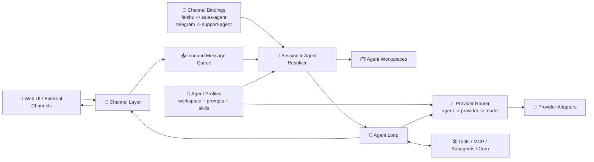

  
  <h2>Aurogen: The Multi-Agent Evolution of OpenClaw.</h1>

Language: **English** | [中文](./docs/README.zh-CN.md)

Aurogen turns the OpenClaw idea into a modular multi-agent runtime with isolated workspaces, a web-first control plane, and a reusable skill ecosystem.

### 🚀 Key Features

**1. 🧩 Decoupled Multi-Agent Runtime with Isolated Workspaces**
Aurogen decouples **channels**, **agents**, and **providers** instead of hard-wiring them into a single execution identity. A channel decides where a message enters, an agent decides which workspace and behavior to use, and the provider layer decides which model backend serves that agent.
*   **🔀 Decoupled routing:** Each conversation resolves `channel -> agent -> workspace`, while model selection resolves `agent -> provider -> model`.
*   **🗂️ Runtime isolation:** Prompts, sessions, skills, and memory stay inside the selected agent workspace rather than leaking across channels.
*   **⚙️ Composable execution:** The same channel can be rebound to another agent later, and different agents can use different providers without changing the channel layer.

**✨ Example**
*   `Feishu account A -> sales-agent -> Anthropic Claude`
*   `Telegram bot -> support-agent -> OpenAI GPT-4o`
*   `Web chat -> research-agent -> OpenRouter Claude Sonnet`
*   All three flows still reuse the same channel layer and agent loop, but they stay separated by agent workspace and provider configuration.

**2. Zero-CLI: 100% Web-Based Orchestration**
Instead of relying on a CLI-first onboarding flow, Aurogen exposes configuration and operations through a web interface.
*   **🌐 Web-first management:** Providers, channels, agents, MCP servers, and scheduled jobs can be configured from the UI.
*   **🚀 Lower setup friction:** Users do not need to memorize terminal commands to get from installation to a working agent deployment.

**3. Seamless Ecosystem Integration**
While the runtime is refactored for better isolation and operability, Aurogen keeps the ecosystem benefits that made OpenClaw attractive.
*   **🧰 Skill reuse:** Built-in skills, ClawHub-style skill distribution, web automation, Cron, and MCP-based extensions remain first-class capabilities.
*   **🔍 More predictable operations:** The modular pipeline makes it easier to trace how a task moved through channels, sessions, tools, and providers.