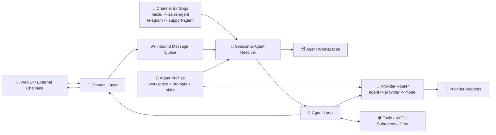
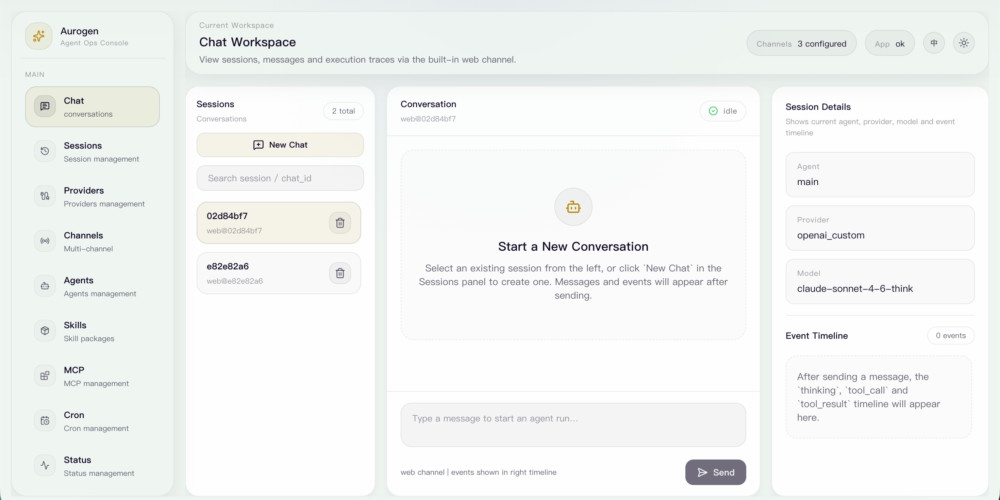

<div align="center">
  
  <h2>Aurogen: The Multi-Agent Evolution of OpenClaw.</h1>
</div>

Language: **English** | [中文](./docs/README.zh-CN.md)

Aurogen turns the OpenClaw idea into a modular multi-agent runtime with isolated workspaces, a web-first control plane, and a reusable skill ecosystem.

### 🚀 Key Features

**1. 🧩 Decoupled Multi-Agent Runtime with Isolated Workspaces**
Aurogen decouples **channels**, **agents**, and **providers** instead of hard-wiring them into a single execution identity. A channel decides where a message enters, an agent decides which workspace and behavior to use, and the provider layer decides which model backend serves that agent.
*   **🔀 Decoupled routing:** Each conversation resolves `channel -> agent -> workspace`, while model selection resolves `agent -> provider -> model`.
*   **🗂️ Runtime isolation:** Prompts, sessions, skills, and memory stay inside the selected agent workspace rather than leaking across channels.
*   **⚙️ Composable execution:** The same channel can be rebound to another agent later, and different agents can use different providers without changing the channel layer.



**✨ Example**
*   `Feishu account A -> sales-agent -> Anthropic Claude`
*   `Telegram bot -> support-agent -> OpenAI GPT-4o`
*   `Web chat -> research-agent -> OpenRouter Claude Sonnet`
*   All three flows still reuse the same channel layer and agent loop, but they stay separated by agent workspace and provider configuration.

**2. Zero-CLI: 100% Web-Based Orchestration**
Instead of relying on a CLI-first onboarding flow, Aurogen exposes configuration and operations through a web interface.
*   **🌐 Web-first management:** Providers, channels, agents, MCP servers, and scheduled jobs can be configured from the UI.
*   **🚀 Lower setup friction:** Users do not need to memorize terminal commands to get from installation to a working agent deployment.


**3. Seamless Ecosystem Integration**
While the runtime is refactored for better isolation and operability, Aurogen keeps the ecosystem benefits that made OpenClaw attractive.
*   **🧰 Skill reuse:** Built-in skills, ClawHub-style skill distribution, web automation, Cron, and MCP-based extensions remain first-class capabilities.
*   **🔍 More predictable operations:** The modular pipeline makes it easier to trace how a task moved through channels, sessions, tools, and providers.

#### 🖥️ Web Console Preview



# 🚀 Get Started

## Install

### 🐳 Docker

Build the image:

```bash
docker build -t aurogen .
```

Run Aurogen and persist the workspace:

```bash
docker run --rm -p 8000:8000 -v "$(pwd)/aurogen/.workspace:/app/aurogen/.workspace" aurogen
```

Then open `http://localhost:8000`.

### 🍎 macOS

Native installation steps coming soon.

### 🪟 Windows

Native installation steps coming soon.

### 🐧 Linux

Native installation steps coming soon.

## 🧭 Quick Setup Flow

Follow this path for the fastest first run:

1. `Install` Aurogen
2. `Set first provider`
3. `Configure first agent`
4. `Bind first channel`
5. `Send a test message`

## 🔑 Set First Provider

After setting your password and signing in, configure your first model provider from the web console:

1. Open `Providers` in the left sidebar.
2. Click `New Provider`, or edit the default provider instance if one already exists.
3. Choose a provider type such as `openai`, `openai_custom`, `anthropic`, `openrouter`, or `ollama`.
4. Fill in the required settings shown by the form, such as `api_key`, `api_base`, or `api_version`.
5. Save the provider, then open `Agents` and bind your agent to that provider and model.
6. Return to `Chat` and send a test message to verify the connection.

### ✨ Common Examples

- `openai_custom`: set `api_key` and `api_base`
- `anthropic`: set `api_key`
- `openrouter`: set `api_key`

### 💡 Tip

If the default `main` agent is already present, you usually only need to update its provider binding in `Agents` after creating the provider instance.

## 🤖 Configure First Agent

Once your provider is ready, open `Agents` and define how the runtime should behave:

1. Open `Agents` from the left sidebar.
2. Click `New Agent`, or edit the existing `main` agent.
3. Set a clear agent name and description, such as `sales-agent`, `support-agent`, or `research-agent`.
4. In `Model Settings`, choose the provider instance you created earlier.
5. Set the target model and optional runtime fields such as `memory_window` or `thinking`.
6. Save the agent.

### ✨ Example

- `sales-agent` -> `anthropic` -> `claude-sonnet`
- `support-agent` -> `openai_custom` -> `gpt-4o`
- `research-agent` -> `openrouter` -> `claude-sonnet`

## 🔌 Bind First Channel

After the agent is ready, connect an entry channel to it:

1. Open `Channels` from the left sidebar.
2. Click `New Channel`, or edit an existing channel such as `web`.
3. Choose the channel type, for example `web`, `feishu`, `telegram`, or `discord`.
4. Set `agent_name` to the agent you want this channel to use.
5. Fill in the channel-specific credentials or settings.
6. Save and reload the channel if required by the page.

### ✨ Example

- `web` -> `research-agent`
- `feishu` -> `sales-agent`
- `telegram` -> `support-agent`

### 💡 Tip

This binding is what makes Aurogen decoupled: the channel decides where messages come from, while the agent decides which workspace, prompts, memory, provider, and tools will be used.

## ✅ Send A Test Message

Finally, verify the whole path end to end:

1. Open `Chat`.
2. Start a new conversation.
3. Send a short test prompt such as `hello` or `summarize this page`.
4. Check the right-side panel to confirm the current `Agent`, `Provider`, and `Model`.
5. If the reply is correct, your first Aurogen runtime is ready.