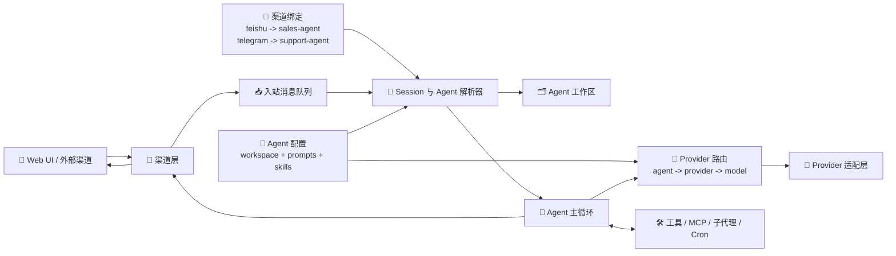

  
  <h2>Aurogen：OpenClaw 的多 Agent 演进形态</h2>

语言： [English](../README.md) | **中文**

Aurogen 将 OpenClaw 的思路扩展为一个更模块化的多 Agent 运行时，强调隔离工作区、Web 优先控制面板，以及可复用的技能生态。

### 关键特性

**1. 🧩 解耦的多 Agent 运行时与隔离工作区**
Aurogen 将 **channel**、**agent**、**provider** 三层能力解耦，而不是把它们绑定成一个不可拆分的执行单元。Channel 决定消息从哪里进入，Agent 决定使用哪个工作区和行为配置，Provider 层再决定由哪个模型后端来响应这个 Agent。
*   **🔀 解耦路由：** 每次对话先走 `channel -> agent -> workspace`，模型选择再走 `agent -> provider -> model`。
*   **🗂️ 运行时隔离：** 提示词、会话、技能和记忆都保存在选定 Agent 的工作区内，不会随着渠道切换而串台。
*   **⚙️ 可组合执行：** 你可以后续把同一个渠道重新绑定到别的 Agent，也可以让不同 Agent 使用不同 Provider，而无需改动渠道层。

**✨ 示例**
*   `飞书账号 A -> sales-agent -> Anthropic Claude`
*   `Telegram bot -> support-agent -> OpenAI GPT-4o`
*   `Web chat -> research-agent -> OpenRouter Claude Sonnet`
*   三条链路复用了同一套渠道层和 Agent 主循环，但会因为 Agent 工作区和 Provider 配置不同而保持隔离。

**2. 零 CLI、Web 优先的编排体验**
Aurogen 不再把初始化和日常运维建立在命令行流程之上，而是把主要配置与操作能力集中到 Web 界面。
*   **🌐 Web 优先管理：** Provider、渠道、Agent、MCP Server 与定时任务都可以从界面配置。
*   **🚀 更低的上手门槛：** 用户无需记忆一组终端命令，便能从安装走到可用的 Agent 部署。

**3. 无缝继承并扩展生态能力**
在重构底层运行时、提升隔离性和可运维性的同时，Aurogen 依然保留了 OpenClaw 生态中最有价值的能力。
*   **🧰 技能生态复用：** 内置技能、ClawHub 风格技能分发、Web 自动化、Cron 与基于 MCP 的扩展能力依旧是一等公民。
*   **🔍 更可预测的执行路径：** 模块化链路让你更容易追踪一次任务如何经过渠道、会话、工具和模型提供方。

### 继续阅读

- 查看英文首页与完整文档：[README](../README.md)
