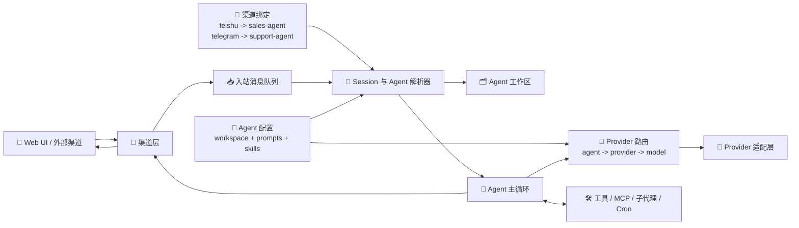

<div align="center">
  
  <h2>Aurogen：OpenClaw 的多 Agent 演进形态</h2>
</div>

语言： [English](../README.md) | **中文**

Aurogen 将 OpenClaw 的思路扩展为一个更模块化的多 Agent 运行时，强调隔离工作区、Web 优先控制面板，以及可复用的技能生态。

### 关键特性

**1. 🧩 解耦的多 Agent 运行时与隔离工作区**
Aurogen 将 **channel**、**agent**、**provider** 三层能力解耦，而不是把它们绑定成一个不可拆分的执行单元。Channel 决定消息从哪里进入，Agent 决定使用哪个工作区和行为配置，Provider 层再决定由哪个模型后端来响应这个 Agent。
*   **🔀 解耦路由：** 每次对话先走 `channel -> agent -> workspace`，模型选择再走 `agent -> provider -> model`。
*   **🗂️ 运行时隔离：** 提示词、会话、技能和记忆都保存在选定 Agent 的工作区内，不会随着渠道切换而串台。
*   **⚙️ 可组合执行：** 你可以后续把同一个渠道重新绑定到别的 Agent，也可以让不同 Agent 使用不同 Provider，而无需改动渠道层。



**✨ 示例**
*   `飞书账号 A -> sales-agent -> Anthropic Claude`
*   `Telegram bot -> support-agent -> OpenAI GPT-4o`
*   `Web chat -> research-agent -> OpenRouter Claude Sonnet`
*   三条链路复用了同一套渠道层和 Agent 主循环，但会因为 Agent 工作区和 Provider 配置不同而保持隔离。

**2. 零 CLI、Web 优先的编排体验**
Aurogen 不再把初始化和日常运维建立在命令行流程之上，而是把主要配置与操作能力集中到 Web 界面。
*   **🌐 Web 优先管理：** Provider、渠道、Agent、MCP Server 与定时任务都可以从界面配置。
*   **🚀 更低的上手门槛：** 用户无需记忆一组终端命令，便能从安装走到可用的 Agent 部署。

**3. 无缝继承并扩展生态能力**
在重构底层运行时、提升隔离性和可运维性的同时，Aurogen 依然保留了 OpenClaw 生态中最有价值的能力。
*   **🧰 技能生态复用：** 内置技能、ClawHub 风格技能分发、Web 自动化、Cron 与基于 MCP 的扩展能力依旧是一等公民。
*   **🔍 更可预测的执行路径：** 模块化链路让你更容易追踪一次任务如何经过渠道、会话、工具和模型提供方。

### 🖥️ Web Console 预览


## 🚀 快速开始

### 🐳 Docker

构建镜像：

```bash
docker build -t aurogen .
```

运行 Aurogen，并持久化工作区：

```bash
docker run --rm -p 8000:8000 -v "$(pwd)/aurogen/.workspace:/app/aurogen/.workspace" aurogen
```

然后访问 `http://localhost:8000`。

### 🍎 macOS

原生安装步骤即将补充。

### 🪟 Windows

原生安装步骤即将补充。

### 🐧 Linux

原生安装步骤即将补充。

## 🧭 快速上手流程

推荐按下面 5 步完成首次配置：

1. `安装` Aurogen
2. `设置第一个 Provider`
3. `配置第一个 Agent`
4. `绑定第一个 Channel`
5. `发送测试消息`

## 🔑 设置第一个 Provider

设置密码并登录后，可以直接在 Web 控制台里完成首个模型 Provider 配置：

1. 在左侧边栏打开 `Providers`。
2. 点击 `New Provider`，如果已经有默认实例，也可以直接编辑它。
3. 选择 Provider 类型，例如 `openai`、`openai_custom`、`anthropic`、`openrouter` 或 `ollama`。
4. 按表单要求填写必要字段，例如 `api_key`、`api_base`、`api_version`。
5. 保存后进入 `Agents`，把目标 Agent 绑定到这个 Provider 和对应模型。
6. 回到 `Chat` 发送一条测试消息，确认链路已经可用。

### ✨ 常见示例

- `openai_custom`：填写 `api_key` 和 `api_base`
- `anthropic`：填写 `api_key`
- `openrouter`：填写 `api_key`

### 💡 提示

如果默认的 `main` Agent 已经存在，通常只需要在创建 Provider 实例后，到 `Agents` 页面更新它的 provider 绑定即可。

## 🤖 配置第一个 Agent

Provider 准备好之后，进入 `Agents` 定义这个运行时应该如何工作：

1. 在左侧边栏打开 `Agents`。
2. 点击 `New Agent`，或直接编辑已有的 `main` Agent。
3. 设置清晰的 Agent 名称和描述，例如 `sales-agent`、`support-agent`、`research-agent`。
4. 在 `Model Settings` 中选择前面创建好的 Provider 实例。
5. 设置目标模型，以及可选参数如 `memory_window`、`thinking`。
6. 保存 Agent 配置。

### ✨ 示例

- `sales-agent` -> `anthropic` -> `claude-sonnet`
- `support-agent` -> `openai_custom` -> `gpt-4o`
- `research-agent` -> `openrouter` -> `claude-sonnet`

## 🔌 绑定第一个 Channel

Agent 配好后，再把消息入口绑定到它：

1. 在左侧边栏打开 `Channels`。
2. 点击 `New Channel`，或直接编辑已有的 `web` 等 Channel。
3. 选择 Channel 类型，例如 `web`、`feishu`、`telegram`、`discord`。
4. 将 `agent_name` 设置为你希望这个 Channel 使用的 Agent。
5. 填写该 Channel 所需的凭证或配置项。
6. 保存；如果页面提示需要重载，就执行重载。

### ✨ 示例

- `web` -> `research-agent`
- `feishu` -> `sales-agent`
- `telegram` -> `support-agent`

### 💡 提示

这一步正是 Aurogen 解耦设计的关键：Channel 只决定消息从哪里进来，Agent 才决定使用哪个工作区、提示词、记忆、Provider 和工具链。

## ✅ 发送一条测试消息

最后做一次端到端验证：

1. 打开 `Chat`。
2. 新建一个会话。
3. 发送一条简短测试消息，例如 `hello` 或 `summarize this page`。
4. 查看右侧面板，确认当前显示的 `Agent`、`Provider`、`Model` 是否符合预期。
5. 如果回复正常，你的第一套 Aurogen 运行时就已经可用了。

### 继续阅读

- 查看英文首页与完整文档：[README](../README.md)
